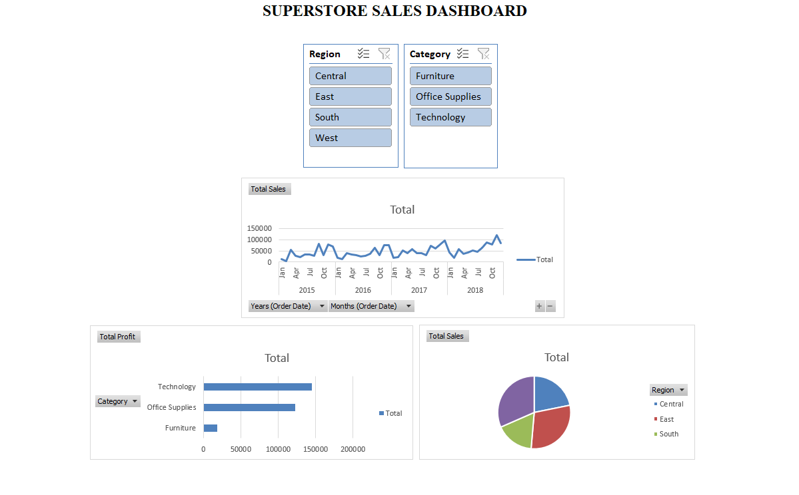
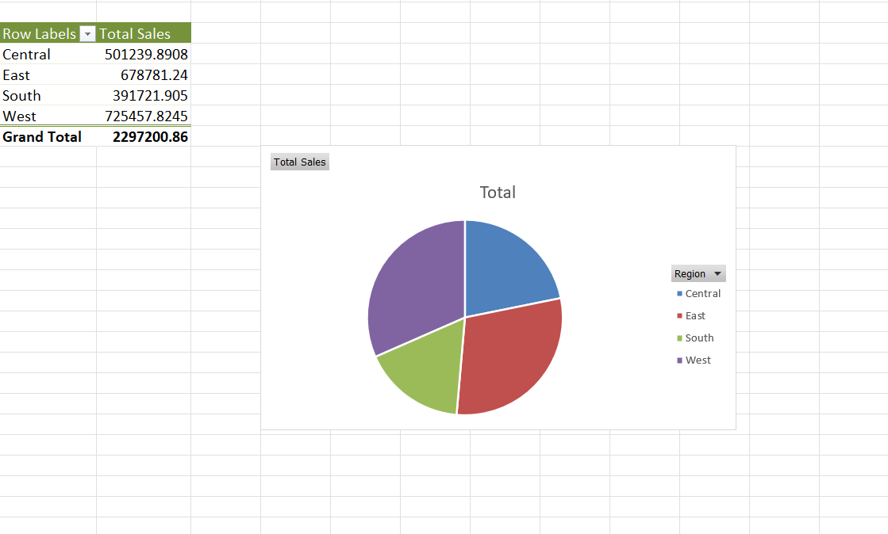
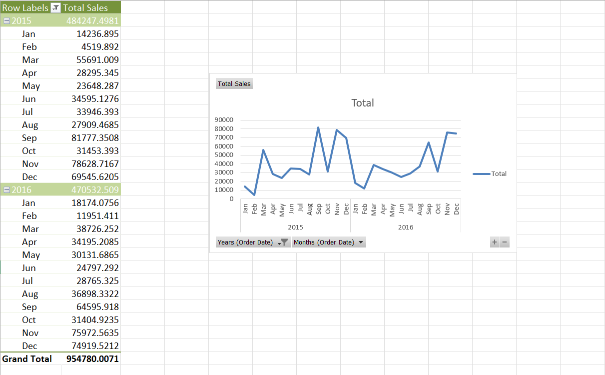

# Superstore Sales Dashboard

This project presents an interactive Sales Dashboard built using Microsoft Excel to analyze sales performance, profit distribution, and regional trends. It enables users to explore data visually and gain actionable business insights.

---

##  Project Overview

Developed an interactive Sales Dashboard using Microsoft Excel as part of a Data Analyst Internship. The dashboard focuses on transforming raw sales data into meaningful insights using data cleaning, aggregation, and visualization techniques.

---

## Dashboard Preview

---

## Key Visuals

The dashboard includes the following visualizations:

* Sales by Region  
* Profit by Category  
* Monthly Sales Trend  
* Overall Sales and Profit Summary  

---

## Sales by Region

Displays the distribution of sales across different regions, helping identify top-performing and underperforming areas for better decision-making.

---

## Profit by Category

Shows profit contribution by each product category, highlighting high-performing categories and those requiring improvement.

---

## Sales Trend

Analyzes sales over time to identify patterns, growth trends, and fluctuations, supporting forecasting and planning.

---

## Tools and Techniques Used

* Microsoft Excel  
* Data Cleaning and Preparation  
* Pivot Tables and Pivot Charts  
* Data Visualization  
* Interactive Dashboard Design  

---

## Key Insights

* Sales performance varies significantly across regions  
* Technology category contributes the highest profit  
* Furniture category shows relatively lower profitability  
* Sales exhibit an overall upward trend with periodic fluctuations  

---

## Files Included

* Superstore_Sales_Dashboard.xlsx  
* dashboard.png  

---

## Conclusion

This dashboard provides a structured and interactive approach to analyzing sales data. It supports data-driven decision-making by clearly presenting trends, patterns, and performance metrics.
